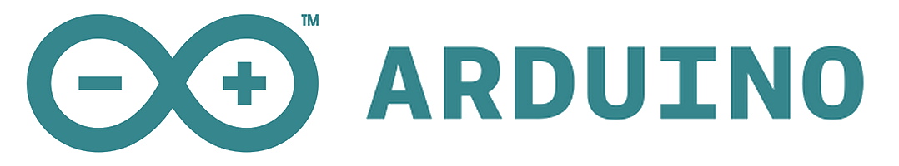
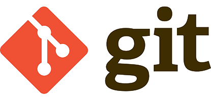
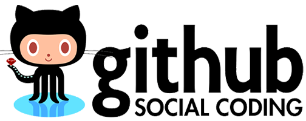
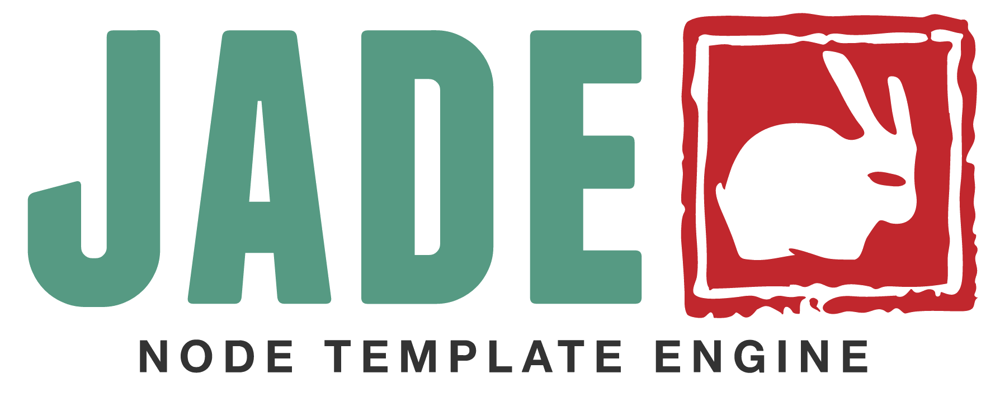
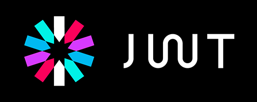
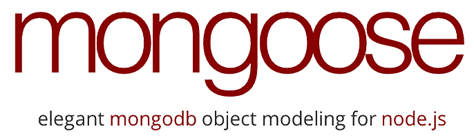
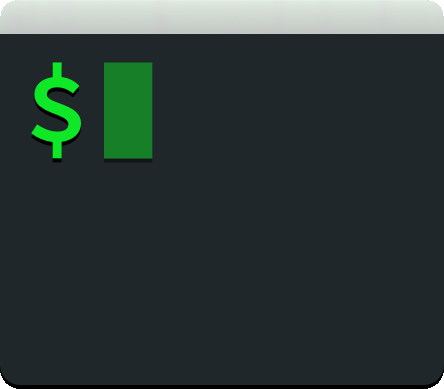
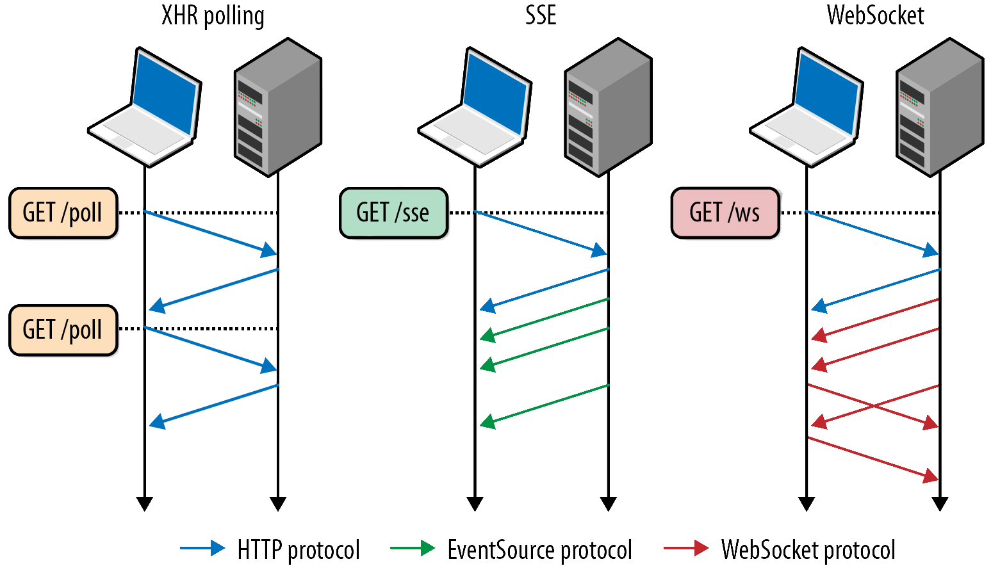

# Prérequis - Glossaire

Cette section détaille l'ensemble des technologies/librairies utilisées. Chaque composant utilisé par Carduino est open-source et bien documenté.

>Vu le grand nombre de dépendances que compte le projet, nous ne détaillerons pas le fonctionnement de chacune dans la suite de la documentation.


## Arduino



Les plates-formes Arduino sont des cartes matériellement libres sur lesquelles se trouve un microcontrôleur (d'architecture Atmel AVR comme par exemple l'Atmega328p). Les schémas de ces cartes sont publiés en licence libre.

Le langage de programmation utilisé est le C++, compilé avec avr-g++ 5, et lié à la bibliothèque de développement Arduino, permettant l'utilisation de la carte et de ses entrées/sorties. La mise en place de ce langage standard rend aisé le développement de programmes sur les plates-formes Arduino, à toute personne maîtrisant le C ou le C++.

> [Documentation Arduino](https://www.arduino.cc/en/Reference/HomePage)


## Express


Express, basé sur Connect.js, est le framework de base utilisé par le serveur Carduino.
Il permet de gérer les communications, les routes (urls / API RESTFull) du serveur, l'authentification, etc.
Il fonctionne grâce à un enchaînement de middlewares.

> [Documentation Express](http://expressjs.com/en/api.html)


## Feathers.js


Feathers.js est une couche d'abstraction au dessus d'express, qui permet la mise en place de services avec un accès commun via une API REST ainsi qu'une API temps-réel (dans notre cas via socket.io).
Notre api n'est donc déclarée qu'une fois dans le code source, et permet par exemple de réaliser des opérations CRUD sur la BDD et de s'authentifier grâce à des mécanismes communs, puis de répondre au client via le bon canal de communication automatiquement (http/https ou Websocket).

> [Documentation Feathers.js](http://docs.feathersjs.com)


## Forever


Forever est un outil en ligne de commande permettant d'exécuter une application node.js de façon continue. Il permet de ne pas avoir à lancer node monApp.js en permanence et surtout de pouvoir aisément gérer l'ensemble des applications node.js qui tournent sur un serveur.

> [Documentation Forever](https://github.com/foreverjs/forever)


## Git



Git est un logiciel de gestion de versions très populaire, se basant sur un modèle décentralisé. C'est un logiciel libre créé par Linus Torvalds, auteur du noyau Linux.

> [Documentation Git](https://git-scm.com/documentation)


## GitBook


GitBook est un outil en Node.js permettant de générer des eBooks et des livres web interactifs via Git et du Markdown. La documentation que vous lisez actuellement est réalisée grâce à GitBook.

> [Documentation GitBook](https://help.gitbook.com)


## GitHub



GitHub est un service web d'hébergement et de gestion de développement de logiciels, utilisant le logiciel de gestion de versions Git.

GitHub est centré vers l'aspect social du développement. En plus d'offrir l'hébergement de projets avec Git, le site offre de nombreuses fonctionnalités habituellement retrouvées sur les réseaux sociaux comme les flux, la possibilité de suivre des personnes ou des projets ainsi que des graphes de réseaux pour les dépôts

> [Documentation GitHub](https://help.github.com)


## Jade



L'interface web se base sur du HTML5. Il sera généré côté serveur grâce au pré-processeur/Moteur de template JADE, dont la syntaxe épurée se base sur l'indentation (syntaxe type HAML).

> [Documentation Jade](http://jade-lang.com/reference/)


## Javascript ES6


Javascript est le langage principal du système. Sa compréhension est indispensable pour comprendre/modifier le système Carduino. Il a l'avantage de ne pas nécessiter de compilation, d'être cross-platform, facile à apprendre, multi-paradigme, de plus en plus populaire, de disposer nativement de fonctionnalités réseau avancées, de fédérer une grande communauté de programmeurs, et d'être un des langages de script les plus rapides.

Les parties client et serveur du système font un usage intensif de Javascript, on peut donc parler de système full-stack Javascript.

Certaines fonctionnalités récemment ajoutées à Javascript grâce à la nouvelle norme ES6 seront utilisées dans le projet. ES6 étant encore à l'état de brouillon, et indisponible dans certains environnements d'exécution, nous utiliserons des pré-processeurs ([Babel](https://babeljs.io) par exemple) pour "transpiler" notre code ES6 en ES5 classique si besoin.

> [Documentation ECMAScript 2015 6th Edition](http://www.ecma-international.org/ecma-262/6.0/)


# JSON Web Token



JSON Web Token (JWT) est un standard (RFC 7519) basé sur JSON pour faire passer des créances entre les différentes parties d’un environnement d'applications Web. Les jetons (tokens) sont conçus pour être compacts, URL-safe, et utilisable en particulier contexte de connexion unique depuis un navigateur. Les JWT peuvent être généralement utilisés pour transmettre l'identité des utilisateurs authentifiés entre un fournisseur d’authentification et un fournisseur de services (application).

Les JWT sont donc des tokens signés, en opposition des tokens obscurs. Il est alors possible d’éliminer tout lien entre l’authentification et l’application (ce qu’on appelle le bénéfice de fédération). Il est possible d’ajouter du contenu dans un JWT, mais il faut savoir qu’il pourra être décrypté par n’importe qui en possession du JWT. En revanche, il n’est pas possible de modifier les informations contenues dans le JWT sans rendre la signature erronée.


Contrairement au systèmes d’authentification par Cookie et session, les JWT ont les avantages suivants :

* Cross-domain / CORS: Les cookies et les requettes cross-domain (nécessaires pour une API publique) ne font pas bon ménage.Une approche basée sur les tokens quand à elle permet de faire des requettes AJAX sur n'importe quel serveur car le token est simplement embarqué dans un header HTTP (`Authorization : Bearer <JWT string>`).

* Scalable: Il n'y a pas besoin d'un moyen de stokage des sessions puisqu'il n'y a pas de session. En effet le token contient déjà les informations de l'utilisateur et rend les sessions inutiles. Pour les navigateurs web, le token peut être maintenu en place dans un Cookie, dans le LocalStorage, ou dans le SessionStorage. Pour les autres clients, il peut être maintenu dans n'importe quelle forme de stockage privé ou en mémoire.

* Decouplage: Nous sommes indépendant du moyen d'authentification utilisé. Le JWT peu être généré n'importe où, et par n'importe quel moyen. Puis l'API est atteinte par un unique moyen, les JWT.

* Mobile-ready: Lorsqu'on travaille sur des plateformes natives (iOS, Android, Windows 8, etc.) les cookies ne sont pas idéaux pour accéder à une API sécurisée. Adopter une approche basée sur les cookies simplifie énormement cette problématique.

* CSRF: Comme nous n'utilisons plus les cookies comme moyen d'authentification, il n'y a plus besoin de se protéger contre les attaques de type CSRF.

* Performance: Un aller-retour réseau (càd trouver une session en base de donnée) est plus lent que de calculer le HMACSHA256 pour valider la signature du token et parser son contenu.

* Login page is not an special case: If you are using Protractor to write your functional tests, you don't need to handle any special case for login.

* Standard: Les JWT sont un standard. Il y a de multiples librairies disponnibles (.NET, Ruby, Java, Python, PHP, NodeJS, Haskell, Erlang, Go), et de grosses compagnies qui basent leurs infrastructures dessus (Firebase, Google, Microsoft, Facebook, etc).


Il est également possible d’effectuer un rafraichissement des JWT, ainsi q’une révocation. Cependant, la révocation implique un accès a une source de données commune entre le serveur d’authentification et l’application, ce qui romp le bénéfice de fédération. On évide donc généralement d’implémenter une révocation de JWT sur les applications hautement scalables. Ceci diminue l’intérêt des JWT vis à vis des tokens obscurs.

> [Documentation JWT](https://jwt.io)


## Markdown


Markdown est un langage de balisage léger créé par John Gruber en 2004. Son but est d'offrir une syntaxe facile à lire et à écrire. Un document formaté selon Markdown devrait pouvoir être publié comme tel, en texte, sans donner l’impression qu’il a été marqué par des balises ou des instructions de formatage.

> [Documentation Markdown](https://github.com/adam-p/markdown-here/wiki/Markdown-Cheatsheet)


## MongoDB


L'ensemble des données amassées par le réseau de capteur est stocké sur une base de données No-SQL MongoDB.
Cette base de donnée est :
* Orientée documents
* Rapide
* Manipule des Objets JSON/BSON
* Hautement scalable
* Souple d'utilisation
* Adaptée aux infrastructures larges (Clouds, Shards, Replica-sets, etc.)
* Adaptée à de grandes quantités de données (Big-Data).

L'accès à cette base de données au sein du serveur sera fait via l'ODM Mongoose, permettant d'établir des modèles et de structurer les données.
Pour l'accès distant à la base de donnée et son l'administration, il est recommandé d'utiliser des clients comme MongoChef, MongoHub ou RoboMongo.

> [Documentation MongoDB](https://docs.mongodb.org/manual/)


## Mongoose



Mongoose est ce qu'on appelle un ODM (Object Documment Mapper) pour MongoDB. C'est en quelque sorte l'équivalent d'un ORM mais pour bases de données orientées documents.

Il permet donc, grâce à des schémas, de structurer les données .

> [Documentation Mongoose](http://mongoosejs.com/docs/api.html)


## NGINX


NGINX (prononcé *engine X*) est un Serveur web open-source. Il est utilisable en remplacement d'un serveur Apache, et dispose de nombreuses fonctionnalités. Il peut, en plus de servir des fichier statiques, être utilisé comme reverse proxy, interpréter des scripts PHP, re-router des requêtes vers une application sur un port local, servir de serveur de messagerie, streamer du contenu video, effectuer du load balancing, et plus encore.

NGINX est un serveur asynchrone par opposition aux serveurs synchrones (comme Apache) où chaque requête est traitée par un processus dédié. Ce choix d'architecture se traduit par des performances très élevées, mais également par une charge et une consommation de mémoire particulièrement faibles

NGINX peut être installé sur des systèmes GNU/Linux, BSD, Mac OS X, Solaris, et Windows.

> [Documentation NGINX](http://nginx.org/en/docs/)


## NodeJS


Le back-end Javascript sera exécuté dans un environnement NodeJS, une plateforme d'exécution Javascript populaire est basée sur le très performant moteur Javascript V8 de chez Google.

> [Documentation NodeJS](https://nodejs.org/api/)


## Npm


Npm (abréviation de Node Package Manager) est le gestionnaire de paquets officiel pour Node.js.

Il est automatiquement installé avec NodeJS. Npm fonctionne avec un terminal et gère les dépendances pour une application. Il permet également d'installer des applications Node.js disponibles sur le dépôt npm.

Npm, c'est plus de 150 millions de packages téléchargés chaque jour.

> [Documentation npm](https://docs.npmjs.com)


## PassportJS


PassportJS est un middleware d'authentification pour Node.js. Extrêmement flexible et modulaire, PasseportJS peut être simplement déposé dans toute application basée sur le framework Express. Un ensemble complet de stratégies supporte l'authentification par couple login/password, des tokens, Facebook, Twitter, et plus encore.

> [Documentation PassportJS](http://passportjs.org/docs)


## Postman


Postman est un logiciel de test d'API. Il permet d'envoyer n'importe quelle requête HTTP et de créer des scénarios d'utilisation pour automatiser  séries de tests. Son utilisation remplace celle de curl, son équivalent en ligne de commande.

> [Documentation Postman](https://www.getpostman.com/docs/)


## Socket.IO


En plus de l'API RESTFull, le serveur dispose également d'une API temps réelle réactive (càd évènementielle) via websocket. Socket.IO est la librairie permettant de gérer les websockets, d'établir des rooms, et de gérer les connexions/reconnexions.

> [Documentation Socket.IO](http://socket.io/docs/)


## SSL/TLS


Transport Layer Security (TLS), et son prédécesseur Secure Sockets Layer (SSL), sont des protocoles de sécurisation des échanges sur Internet. Ils permettent de passer de `http://` à `https://`, et pour les Websockets de `ws://` à `wss://`. Ces protocoles de sécurité nécessitent l'utilisation d'un certificat SSL (auto-signé ou non) pour fonctionner. Dans le cas d'un certificat auto-signé (càd gratuit), la pluspart des navigateurs refusent la connexion car elle n'est pas "trusted" par une entité de certification reconnue (Comodo, GeoTrust, RapidSSL, VeriSign, etc).

> [Documentation SSL/TLS]()


## Stylus


La mise en forme de l'interface web se base sur CSS3. Il sera généré côté serveur grâce au pré-processeur Stylus, dont la syntaxe épurée se base sur l'indentation (syntaxe type SASS/SCSS améliorée).

> [Documentation Stylus](http://stylus-lang.com)


## Système d'exploitation


L'ensemble du système informatique a été développé pour une utilisation optimale sur des systèmes Linux (Debian pour le serveur et Raspian pour les hubs).

Néanmoins, il est possible, sans portage particulier, de lancer le serveur sur la pluspart des systèmes Linux (Debian, Ubuntu, Fedora, etc), ainsi que d'autres systèmes UNIX comme Mac-OSX ou FreeBSD. Il est théoriquement possible de lancer le serveur sur des plateformes Windows, mais certaines dépendances et parties de code spécifiques devront êtres portées.

Concernant les concentrateurs, Il est possible d'utiliser différentes distributions de Linux, mais la partie concernant l'acquisition des données (les communications via le GPIO du Raspberry Pi) devra certainement être adaptée.

À l'heure actuelle, Raspbian se base sur la dernière version de Debian (version 8 / Debian Jessie). Les OS de tout le système Carduino font donc preuve d'une certaine unité qui facilite le travail.
> [Documentation de Debian](https://www.debian.org/doc/)

> [Documentation de Raspbian](https://www.raspbian.org/RaspbianDocumentation)


## Terminal SSH



L'installation/configuration/lancement de tout le système se fait quasi-systématiquement via SSH.

Il faut donc disposer d'un terminal permettant d'établir une connexion SSH sur la machine utilisée pour installer/configurer/lancer le système Cardiuno. C'est le cas de tous les Linux et de Mac OS-X. Pour Windows, il faudra passer par un logiciel comme `PuTTY`, ou d'une machine virtuelle Linux pour disposer d'un terminal performant.

Connexion SSH vers un serveur :
```bash
ssh -p <port du serveur> <utilisateur>@<IP ou ndd>
```
Déconnexion : `Ctrl`+`d`

> [Documentation SSH Debian](https://wiki.debian.org/fr/SSH)


## WebSockets


WebSocket est un standard du Web désignant un protocole réseau de la couche application et une interface de programmation du World Wide Web visant à créer des canaux de communication full-duplex par dessus une connexion TCP.



Avec cette API vous pouvez envoyer des messages à un serveur et recevoir ses réponses de manière événementielle sans avoir à aller consulter le serveur pour obtenir une réponse.

> [Documentation WebSockets](https://developer.mozilla.org/fr/docs/WebSockets)


## Yeoman


Yeoman est un projet Open Source géré par l’équipe de développement de Chrome qui permet d'échafauder, et de gérer des applications web rapidement. C'est une sorte de générateur d'applications.

> [Documentation Yeoman](http://yeoman.io)