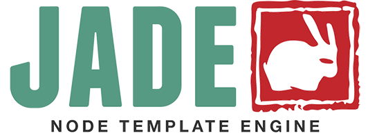
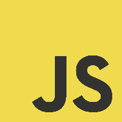

# Prérequis - Glossaire

Cette section détaille l'ensemble des technologies/librairies utilisées. Chaque composant utilisé par Carduino est open-source et bien documenté.

>Vu le grand nombre de dépendances que compte le projet, nous ne détaillerons pas le fonctionnement de chacune dans la suite de la documentation.


## Arduino


Les plates-formes Arduino sont des cartes matériellement libres sur lesquelles se trouve un microcontrôleur (d'architecture Atmel AVR comme par exemple l'Atmega328p). Les schémas de ces cartes sont publiés en licence libre.

Le langage de programmation utilisé est le C++, compilé avec avr-g++ 5, et lié à la bibliothèque de développement Arduino, permettant l'utilisation de la carte et de ses entrées/sorties. La mise en place de ce langage standard rend aisé le développement de programmes sur les plates-formes Arduino, à toute personne maîtrisant le C ou le C++.

> [Documentation Arduino](https://www.arduino.cc/en/Reference/HomePage)


## Express


Express, basé sur Connect.js, est le framework de base utilisé par le serveur Carduino.
Il permet de gérer les communications, les routes (urls / API RESTFull) du serveur, l'authentification, etc.
Il fonctionne grâce à un enchaînement de middlewares.

> [Documentation Express](http://expressjs.com/en/api.html)


## Feathers.js


Feathers.js est une couche d'abstraction au dessus d'express, qui permet la mise en place de services avec un accès commun via une API REST ainsi qu'une API temps-réel (dans notre cas via socket.io).
Notre api n'est donc déclarée qu'une fois dans le code source, et permet par exemple de réaliser des opérations BDD et de s'authentifier grâce à des mécanismes communs, puis de répondre au client via le bon canal de communication automatiquement.

> [Documentation Feathers.js](http://docs.feathersjs.com)


## Forever


Forever est un outil en ligne de commande permettant d'exécuter une application node.js de façon continue. Il permet de ne pas avoir à lancer node monApp.js en permanence et surtout de pouvoir aisément gérer l'ensemble des applications node.js qui tournent sur un serveur.

> [Documentation Forever](https://github.com/foreverjs/forever)


## Git


Git est un logiciel de gestion de versions décentralisé. C'est un logiciel libre créé par Linus Torvalds, auteur du noyau Linux.

> [Documentation Git](https://git-scm.com/documentation)


## GitBook


GitBook est un outil en Node.js permettant de générer des eBooks et des livres web interactifs via Git et du Markdown. La documentation que vous lisez actuellement est réalisée grâce à GitBook.

> [Documentation GitBook](https://help.gitbook.com)


## GitHub


GitHub est un service web d'hébergement et de gestion de développement de logiciels, utilisant le logiciel de gestion de versions Git.

GitHub est centré vers l'aspect social du développement. En plus d'offrir l'hébergement de projets avec Git, le site offre de nombreuses fonctionnalités habituellement retrouvées sur les réseaux sociaux comme les flux, la possibilité de suivre des personnes ou des projets ainsi que des graphes de réseaux pour les dépôts

> [Documentation GitHub](https://help.github.com)


## Jade



L'interface web se base sur du HTML5. Il sera généré côté serveur grâce au pré-processeur/Moteur de template JADE, dont la syntaxe épurée se base sur l'indentation (syntaxe type HAML).

> [Documentation Jade](http://jade-lang.com/reference/)


## Javascript ES6



Javascript est le langage principal du système. Sa compréhension est indispensable pour comprendre/modifier le système Carduino. Il à l'avantage de ne pas nécessiter de compilation, d'être cross-platform, facile à apprendre, multi-paradigme, de plus en plus populaire, de disposer nativement de fonctionnalités réseau avancées, de fédérer une grande communauté de programmeurs, et d'être un des langages de script les plus rapides.

La partie Client du système fait également un usage intensif de Javascript, on peut donc parler de système full-stack Javascript.

Certaines fonctionnalités récemment ajoutés à Javascript grâce à la nouvelle norme ES6 seront utilisées dans le projet. ES6 étant encore à l'état de brouillon, et indisponible dans certains environnements d'exécution, nous utiliseront des pré-processeurs ([Babel](https://babeljs.io) par exemple) pour "compiler" notre code ES6 en ES5 classique si besoin.

> [Documentation ECMAScript 2015 6th Edition](http://www.ecma-international.org/ecma-262/6.0/)


## Markdown


Markdown est un langage de balisage léger créé par John Gruber en 2004. Son but est d'offrir une syntaxe facile à lire et à écrire. Un document formaté selon Markdown devrait pouvoir être publié comme tel, en texte, sans donner l’impression qu’il a été marqué par des balises ou des instructions de formatage.

> [Documentation Markdown](https://github.com/adam-p/markdown-here/wiki/Markdown-Cheatsheet)


## MongoDB


L'ensemble des données amassées par le réseau de capteur est stocké sur une base de donnée No-SQL MongoDB.
Cette base de donnée est :
Orientée documents
Rapide
Manipule des Objets JSON/BSON
Hautement scalable
Souple d'utilisation
Adaptée aux infrastructures complexes (Clouds, Shards, Replica-sets, etc.)
Adaptée a de grandes quantités de données.

L'accès à cette base de donnée au sein du serveur sera fait via l'ODM Mongoose, permettant d'établir des modèles et de structurer les données.
Pour un accès direct à la base de donnée, il est recommandé d'utiliser des clients comme MongoChef, MongoHub ou RoboMongo.

> [Documentation MongoDB](https://docs.mongodb.org/manual/)


## Mongoose


Mongoose est ce qu'on appelle un ODM (Object Documment Mapper) pour MongoDB. C'est en quelques sortes l'équivalent d'un ORM mais pour bases de données orientées documents.

> [Documentation Mongoose](http://mongoosejs.com/docs/api.html)


## NodeJS


Le back-end Javascript sera exécuté dans un environnement NodeJS, une plateforme d'exécution Javascript populaire est basé sur le très performant moteur Javascript V8 de chez Google.

> [Documentation NodeJS](https://nodejs.org/api/)


## npm


npm (abréviation de Node Package Manager) est le gestionnaire de paquets officiel pour Node.js.

Il est automatiquement installé avec NodeJS. npm fonctionne avec un terminal et gère les dépendances pour une application. Il permet également d'installer des applications Node.js disponibles sur le dépôt npm.

npm, c'est plus de 150 millions de packages téléchargés chaque jour.

> [Documentation npm](https://docs.npmjs.com)


## PassportJS


Passport un middleware l'authentification pour Node.js. Extrêmement flexible et modulaire, Passeport peut être simplement déposé dans toute application basée sur le framework Express. Un ensemble complet de stratégies supportent l'authentification en utilisant un couple Login/mot de passe, des token, Facebook, Twitter, et plus encore.

> [Documentation PassportJS](http://passportjs.org/docs)


## Socket.IO


En plus de l'API RESTFull, le serveur dispose également d'une API temps réelle réactive (système de Push) via websocket. Socket.IO est la librairie permettant de gérer les websockets, d'établir des rooms, et de gérer les connexions/reconnexion.

> [Documentation Socket.IO](http://socket.io/docs/)


## Stylus


La mise en forme de l'interface web se base sur CSS3. Il sera généré coté serveur  grâce au pré-processeur Stylus, dont la syntaxe épurée se base sur l'indentation (syntaxe type SASS/SCSS améliorée).

> [Documentation Stylus](http://stylus-lang.com)


## Système d'exploitation


L'ensemble du système informatique à été développé pour une utilisation optimale sur des systèmes Linux (Debian pour le serveur et Raspian pour les concentrateurs).

Néanmoins, il est possible, sans portage particulier, de lancer le serveur sur la plus part des système Linux (Debian, Ubuntu, Fedora, etc), ainsi que d'autres systèmes UNIX comme Mac-OSX ou FreeBSD. Il est théoriquement possible de lancer le serveur sur des plateformes Windows, mais certaines dépendances et parties de code spécifiques devront êtres portés.

Concernant les concentrateurs, Il est possible d'utiliser différentes distributions de Linux, mais la partie concernant l'acquisition des données (les communications via le GPIO du Raspberry Pi) devra certainement être adaptée.

À l'heure actuel, Raspbian se base sur la dernière version de Debian (version 8 / Debian Jessie). Les OS de tous le système Carduino font donc preuve d'une certaine unité qui facilite le travail.
> [Documentation de Debian](https://www.debian.org/doc/)

> [Documentation de Raspbian](https://www.raspbian.org/RaspbianDocumentation)


## Terminal SSH


L'installation/configuration/lancement de tout le système se fait quasi-systématiquement via SSH.

Il faut donc disposer d'un terminal permettant d'établir une connexion SSH sur la machine utilisée pour installer/configurer/lancer le système Cardiuno. C'est le cas de tous les Linux et de Mac OS-X. Pour Windows, il faudra passer par un logiciel comme `PuTTY`, ou d'une machine virtuelle Linux pour disposer d'un terminal performant.

Connexion SSH vers un serveur :
```bash
ssh -p <port du serveur> <utilisateur>@<IP ou ndd>
```
Déconnexion : `Ctrl`+`d`

> [Documentation SSH Debian](https://wiki.debian.org/fr/SSH)